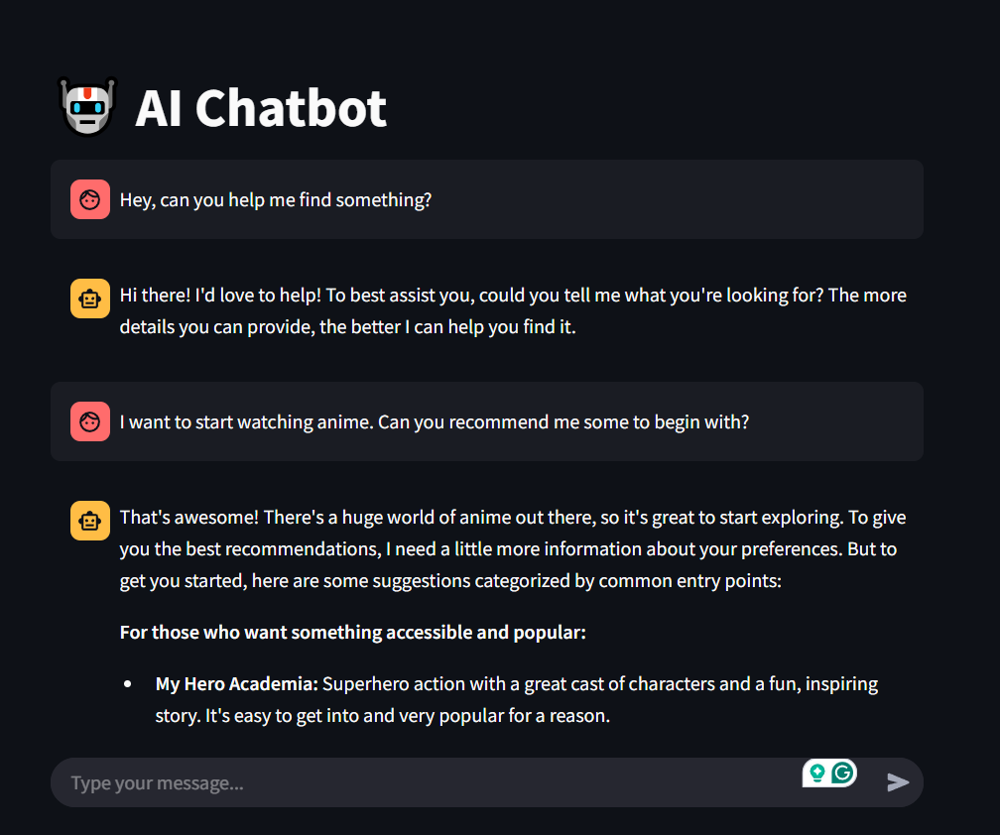

# Streamlit AI Chatbot (With Gemini API)

This is a simple chatbot built using **Streamlit** and **Google Gemini AI**. The chatbot interacts with users, maintains chat history, and provides intelligent responses.

## Features

- 💬 **Chat with AI**: Engage in dynamic conversations.
- 📝 **Maintains chat history**: Previous messages are retained during the session.
- 🎨 **User-friendly Interface**: Simple and clean UI using Streamlit.

## Install dependencies

```sh
pip install -r requirements.txt
```

_Note_: May need to setup [Rust](https://rustup.rs/) for it to work.

## Running the Chatbot

Run the following command to start the chatbot:

```sh
streamlit run main.py
```

This will launch the chatbot in your browser.

## Screenshot

Below is an example of the chatbot interface:


